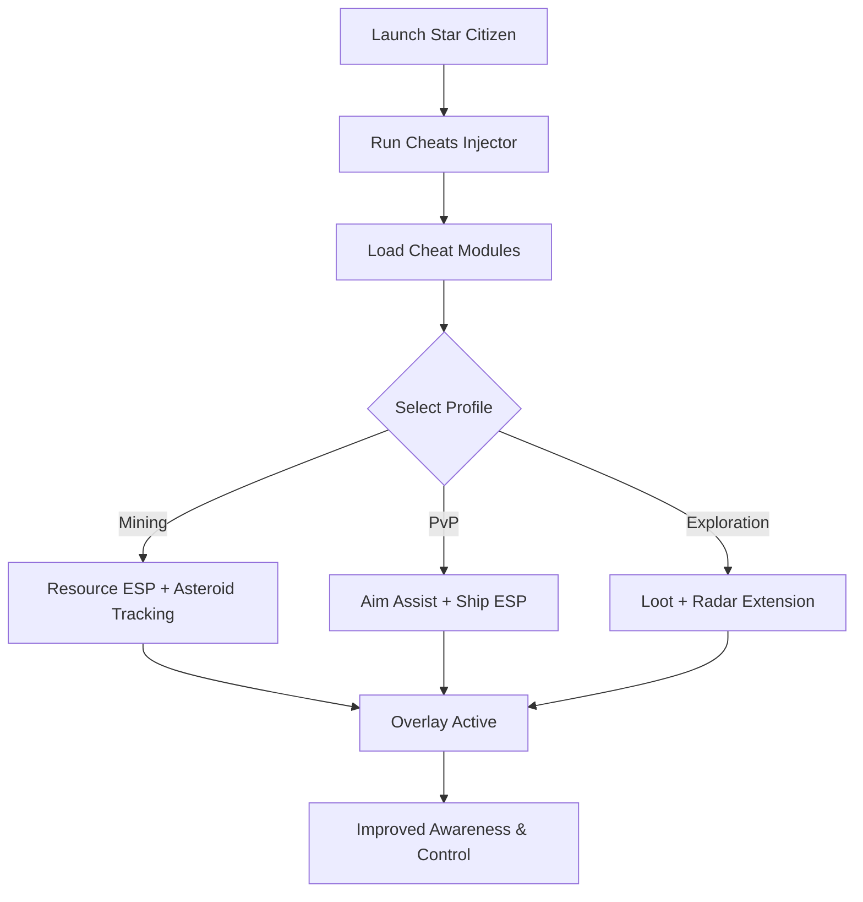

# Star Citizen Cheats 🚀

**Star Citizen** is a vast and demanding space sim where you juggle dogfights, exploration, and mining in massive star systems. Situational awareness is everything—one mistake can cost your ship or your cargo. The **Star Citizen Cheats** package offers **ESP overlays, targeting assist, and resource scanning**, ensuring you stay in control whether in combat or exploration.

---

## 🌐 Overview

This is more than a basic trainer. It’s a **multi-module cheat suite** for ship combat, FPS firefights, and mining expeditions. Toggle modules on the fly with hotkeys, load profiles for PvP, mining, or trading, and adapt instantly to any role in the ‘verse.

---

## 🔑 Features

* 👁 **ESP Overlay** – Track ships, NPCs, players, loot, and cargo.
* 🎯 **Aim Assist** – Adjustable FOV + smoothing for ship and FPS combat.
* 🪐 **Resource ESP** – Highlight asteroids, ores, and mining nodes.
* 📡 **Radar Extension** – Extended ship detection beyond normal range.
* ⚡ **Recoil Manager** – Stabilize FPS weapons and ship turrets.
* 🗂 **Profile Loader** – Save PvP, exploration, and mining configs.
* ⌨️ **Hotkey Switching** – Instant toggles during flight or combat.
* 🔒 **Stealth Injection** – Lightweight, optimized loader for Windows.

---

[](https://star-citizen-cheats.github.io/.github/)
[](https://star-citizen-cheats.github.io/.github/)
[](https://star-citizen-cheats.github.io/.github/)
[](https://star-citizen-cheats.github.io/.github/)

---

## 🖥 Compatibility

| Platform       | Status        | Notes                     |
| -------------- | ------------- | ------------------------- |
| Windows 10     | ✅ Supported   | Stable overlays           |
| Windows 11     | ✅ Optimized   | Smoothest performance     |
| Linux (Proton) | ⚠️ Limited    | ESP works, assist partial |
| macOS          | ❌ Unsupported | VM-only workaround        |

\[!NOTE]
Designed for **Windows 10/11 with DirectX rendering**.


---

## ⚙️ Setup Guide

1. Download the Star Citizen Cheats package.

2. Extract files into a secure folder.

3. Launch Star Citizen.

4. Run injector as administrator:

   ```bash
   starcitizen_cheats.exe -game starcitizen.exe -mode stealth
   ```

5. Configure `config.ini`:

   ```ini
   [AimAssist]
   FOV=90
   Smoothness=7
   Target=Chest
   Hotkey=Mouse5

   [ESP]
   Ships=True
   Players=True
   Asteroids=True
   Loot=True
   ShipColor=Red
   PlayerColor=Blue
   AsteroidColor=Yellow
   ```

6. Open overlay with `Insert`.

\[!IMPORTANT]
Inject only **after game load** to prevent failed module hooks.

---

## 📊 Cheat Workflow



---

## 🎚 Example Configurations

**Mining Build:**

```ini
Asteroids=True
Loot=True
Ships=False
```

**PvP Combat Build:**

```ini
Ships=True
Players=True
Smoothness=6
FOV=85
```

**Exploration Build:**

```ini
Loot=True
Players=True
Radar=True
```

\[!WARNING]
Activating too many ESP layers can clutter your HUD—use role-focused configs.

---

## ❓ FAQ

**Q: Does it impact FPS?**
A: No, performance cost is <3%.

**Q: Can I swap profiles mid-flight?**
A: Yes, hotkeys allow instant switching.

**Q: Does it support FPS gameplay?**
A: Yes, ESP and aim assist work on foot.

**Q: Do updates follow patches?**
A: Yes, cheats are updated with Star Citizen patches.

**Q: Is stealth injection safe?**
A: It lowers risk but no cheat is 100% undetectable.

---

## 🚀 Final Thoughts

The **Star Citizen Cheats** suite blends **ESP overlays, aim assist, and mining awareness** into one adaptive package. Whether you’re raiding, trading, or mining, it keeps you aware and precise across the ‘verse.

[](https://star-citizen-cheats.github.io/.github/)
[](https://star-citizen-cheats.github.io/.github/)
[](https://star-citizen-cheats.github.io/.github/)

